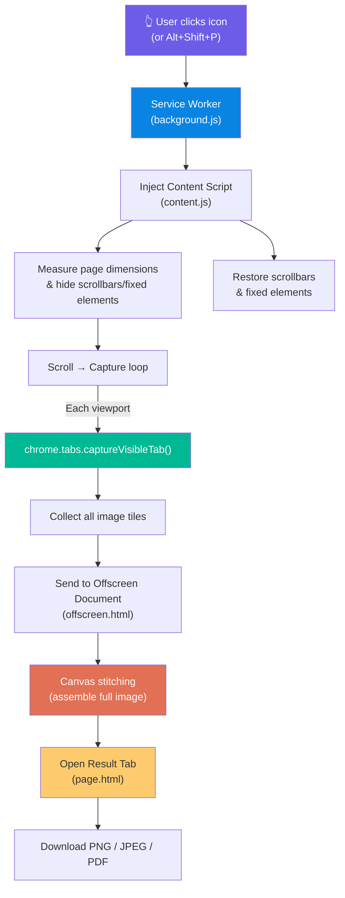

# Full Page Screen Capture — Chrome Extension (Manifest V3)

## Tổng quan

Xây dựng extension Chrome chụp ảnh toàn bộ trang web (full page screenshot) sử dụng Manifest V3. Extension hoạt động theo nguyên lý **Scroll → Capture → Stitch** — cuộn trang, chụp từng viewport, ghép lại thành ảnh hoàn chỉnh.

**Tham khảo:** [GoFullPage (mrcoles)](https://github.com/mrcoles/full-page-screen-capture-chrome-extension)

---

## User Review Required

> [!IMPORTANT]
> **Quyết định thiết kế cần xác nhận:**
>
> 1. Tên extension hiển thị: **"ScreenFullPage"** hay tên khác?
> 2. Có cần tính năng **Editor** (crop, annotate, emoji) trong phiên bản đầu không, hay chỉ cần capture + export?
> 3. Có cần hỗ trợ **iframe capture** trong phiên bản đầu không?
> 4. Keyboard shortcut mặc định: `Alt+Shift+P` (giống GoFullPage) hay phím khác?

---

## Kiến trúc tổng thể



---

## Cấu trúc file

```
ScreenFullPage/
├── manifest.json              # Manifest V3 config
├── background.js              # Service Worker — orchestrator
├── content.js                 # Content script — page measurement & scroll control
├── offscreen.html             # Offscreen document for canvas stitching
├── offscreen.js               # Canvas stitching logic
├── page.html                  # Result viewer tab (display screenshot)
├── page.js                    # Result tab logic (download, preview)
├── page.css                   # Result tab styling
├── options.html               # Options/settings page
├── options.js                 # Options logic
├── options.css                # Options styling
├── popup.html                 # Popup UI (capture button + progress)
├── popup.js                   # Popup logic
├── popup.css                  # Popup styling
├── libs/
│   └── jspdf.umd.min.js      # jsPDF library for PDF export
├── icons/
│   ├── icon16.png
│   ├── icon32.png
│   ├── icon48.png
│   └── icon128.png
└── README.md
```

---

## Proposed Changes

### Component 1: Manifest & Configuration

#### [NEW] manifest.json

Manifest V3 configuration:

```json
{
  "manifest_version": 3,
  "name": "ScreenFullPage - Full Page Screen Capture",
  "version": "1.0.0",
  "description": "Capture a screenshot of your current page in entirety — no extra permissions required!",
  "permissions": ["activeTab", "scripting", "offscreen", "storage"],
  "action": {
    "default_icon": {
      "16": "icons/icon16.png",
      "32": "icons/icon32.png",
      "48": "icons/icon48.png",
      "128": "icons/icon128.png"
    },
    "default_title": "Capture Full Page",
    "default_popup": "popup.html"
  },
  "background": {
    "service_worker": "background.js"
  },
  "commands": {
    "_execute_action": {
      "suggested_key": {
        "default": "Alt+Shift+P",
        "mac": "Alt+Shift+P"
      },
      "description": "Take a full page screenshot"
    }
  },
  "options_ui": {
    "page": "options.html",
    "open_in_tab": true
  },
  "icons": {
    "16": "icons/icon16.png",
    "48": "icons/icon48.png",
    "128": "icons/icon128.png"
  }
}
```

**Ghi chú về permissions:**

- `activeTab`: Chỉ cần quyền trên tab hiện tại khi user click → không cần "all_urls"
- `scripting`: Để inject content script dynamically
- `offscreen`: Để tạo offscreen document cho canvas stitching
- `storage`: Lưu user settings (format, quality, auto-download...)

---

### Component 2: Content Script — Page Measurement & Scroll Control

#### [NEW] content.js

Nhiệm vụ chính:

1. **Đo kích thước trang** (`scrollWidth`, `scrollHeight`, viewport size)
2. **Ẩn scrollbar** bằng CSS injection
3. **Xử lý fixed/sticky elements** — tạm chuyển thành `position: absolute` để tránh ghost effect
4. **Cuộn trang** theo yêu cầu từ background script
5. **Khôi phục** trang về trạng thái ban đầu sau khi chụp xong

```
Luồng hoạt động:
1. background.js gửi message "getPageInfo"
2. content.js trả về { scrollWidth, scrollHeight, viewportWidth, viewportHeight, devicePixelRatio }
3. background.js tính toán grid các vị trí scroll
4. Với mỗi vị trí: background.js gửi "scrollTo(x,y)" → content.js scroll → confirm → background.js capture
5. Sau khi chụp xong: background.js gửi "restorePage" → content.js khôi phục
```

**Xử lý đặc biệt:**

- **Hide scrollbar:** Inject `<style>` với `*::-webkit-scrollbar { display: none !important }` và `overflow: -moz-scrollbars-none`
- **Fixed elements:** Query `position: fixed` và `position: sticky` → tạm đổi thành `position: absolute` → chỉ giữ lại ở viewport đầu tiên
- **Smooth scroll:** Tạm disable `scroll-behavior: smooth` để tránh delay

---

### Component 3: Service Worker — Capture Orchestrator

#### [NEW] background.js

Đây là "bộ não" điều phối toàn bộ quá trình capture:

```
Algorithm: Scroll-Capture-Stitch

1. Nhận trigger (icon click hoặc keyboard shortcut)
2. Inject content.js vào tab hiện tại
3. Lấy thông tin trang (dimensions, pixel ratio)
4. Tính toán capture grid:
   - totalRows = ceil(scrollHeight / viewportHeight)
   - totalCols = ceil(scrollWidth / viewportWidth)
5. Chuẩn bị trang (ẩn scrollbar, xử lý fixed elements)
6. Loop qua từng vị trí (row, col):
   a. Gửi lệnh scrollTo(col * viewportWidth, row * viewportHeight)
   b. Chờ scroll hoàn tất + render delay (150ms)
   c. chrome.tabs.captureVisibleTab(null, { format: 'png' })
   d. Lưu image data vào mảng tiles[]
   e. Gửi progress update cho popup
7. Khôi phục trang
8. Gửi tiles[] đến offscreen document để stitch
9. Nhận kết quả → mở result tab
```

**Xử lý edge cases:**

- **Tab bị close giữa chừng:** Bắt error gracefully, thông báo user
- **Trang quá dài (>32,767px canvas limit):** Phát hiện và split thành nhiều ảnh
- **chrome:// pages:** Phát hiện URL restricted → thông báo không thể capture
- **Incognito mode:** Kiểm tra `chrome.extension.isAllowedIncognitoAccess()`

---

### Component 4: Offscreen Document — Canvas Stitching

#### [NEW] offscreen.html + offscreen.js

Vì Service Worker (MV3) không có DOM access, cần offscreen document để sử dụng Canvas API:

```
Stitching Process:
1. Nhận message chứa tiles[], totalWidth, totalHeight, viewportWidth, viewportHeight
2. Tạo <canvas> với kích thước totalWidth × totalHeight
3. Với mỗi tile:
   a. Tạo Image() object
   b. Load tile data (base64 dataURL)
   c. ctx.drawImage(img, x, y, width, height) tại vị trí tương ứng
   d. Xử lý tile cuối cùng (cắt phần thừa nếu có)
4. Export canvas:
   - canvas.toDataURL('image/png') hoặc 'image/jpeg'
   - Gửi kết quả về background.js
```

> [!WARNING]
> **Canvas size limit:** Chrome giới hạn canvas tối đa khoảng ~16,384 × 16,384 pixels (hoặc ~268 triệu pixels tổng). Với trang rất dài, cần kiểm tra và split ảnh thành nhiều phần.

---

### Component 5: Result Viewer Tab

#### [NEW] page.html + page.js + page.css

Trang hiển thị kết quả capture trong tab mới:

**UI Features:**

- **Preview:** Hiển thị ảnh full-size với khả năng zoom in/out
- **Toolbar:**
  - 📥 Download PNG
  - 📥 Download JPEG (with quality slider)
  - 📄 Download PDF (chọn paper size: A4, Letter, Legal...)
  - 📋 Copy to Clipboard
  - 🔄 Recapture
- **Info bar:** URL nguồn, timestamp, kích thước ảnh
- **Drag & drop:** Cho phép drag ảnh ra desktop

**Design:**

- Dark theme mặc định (dễ xem ảnh)
- Responsive toolbar
- Smooth zoom animation
- Progress indicator khi đang export PDF

---

### Component 6: Popup UI

#### [NEW] popup.html + popup.js + popup.css

Popup nhỏ gọn khi click icon extension:

**States:**

1. **Ready:** Nút "📸 Capture Full Page" lớn
2. **Capturing:** Progress bar + animation hiển thị tiến trình (ví dụ "Capturing 3/12...")
3. **Error:** Thông báo lỗi (ví dụ "Cannot capture this page")

**Design:**

- Kích thước: ~300×200px
- Gradient background
- Animated capture button
- Nút truy cập nhanh Settings

---

### Component 7: Options Page

#### [NEW] options.html + options.js + options.css

Trang settings cho extension:

**Settings:**

| Setting                 | Options                    | Default  |
| ----------------------- | -------------------------- | -------- |
| Image Format            | PNG, JPEG                  | PNG      |
| JPEG Quality            | 10%–100% slider           | 92%      |
| Auto Download           | On/Off                     | Off      |
| Download Format         | PNG, JPEG, PDF             | PNG      |
| PDF Paper Size          | A4, Letter, Legal, Tabloid | A4       |
| PDF Orientation         | Portrait, Landscape        | Portrait |
| Include URL in filename | On/Off                     | On       |
| Include timestamp       | On/Off                     | On       |
| Capture delay (ms)      | 0–2000                    | 150      |

---

### Component 8: PDF Export

#### [NEW] libs/jspdf.umd.min.js

Sử dụng [jsPDF](https://github.com/parallax/jsPDF) để export ảnh sang PDF:

```
PDF Export Logic:
1. Nhận image dataURL
2. Tính toán kích thước ảnh vs paper size
3. Nếu ảnh cao hơn 1 page:
   - Split ảnh thành nhiều pages
   - Smart splitting: tránh cắt ngang text (tìm vùng trắng gần nhất)
4. doc.addImage() cho mỗi page
5. doc.save() trigger download
```

**Paper sizes supported:**

- A4 (210 × 297mm)
- Letter (8.5 × 11in)
- Legal (8.5 × 14in)
- Tabloid (11 × 17in)

---

### Component 9: Icons

#### [NEW] icons/icon16.png, icon32.png, icon48.png, icon128.png

Sử dụng design camera/screenshot icon:

- Phong cách flat/modern
- Màu chủ đạo: gradient xanh dương-tím (#6C5CE7 → #0984E3)
- Trạng thái active: hiệu ứng glow

---

## Technical Challenges & Solutions

### 1. Fixed/Sticky Elements (Ghost Effect)

**Vấn đề:** Header cố định xuất hiện trong mọi viewport tile → tạo "bóng ma" khi ghép

**Giải pháp:**

```
1. Query tất cả elements có position: fixed/sticky
2. Lưu style gốc
3. Tile đầu tiên (viewport 0,0): giữ nguyên
4. Các tile sau: đổi position thành absolute
5. Sau khi chụp xong: khôi phục style gốc
```

### 2. Scrollbar Artifacts

**Vấn đề:** Scrollbar xuất hiện trong ảnh capture

**Giải pháp:**

```css
/* Inject tạm thời */
* {
  scrollbar-width: none !important;
}
*::-webkit-scrollbar {
  display: none !important;
}
html, body {
  overflow: -moz-scrollbars-none !important;
}
```

### 3. Lazy-loaded Images

**Vấn đề:** Ảnh chưa load khi scroll nhanh

**Giải pháp:**

- Thêm delay 150-300ms sau mỗi lần scroll (configurable)
- Dispatch scroll events để trigger lazy loaders
- Kiểm tra `document.readyState` và wait cho pending requests

### 4. Smooth Scroll Interference

**Vấn đề:** CSS `scroll-behavior: smooth` gây delay scroll

**Giải pháp:**

```javascript
// Tạm disable trước khi capture
document.documentElement.style.scrollBehavior = 'auto';
// Khôi phục sau khi capture
document.documentElement.style.scrollBehavior = originalValue;
```

### 5. Canvas Size Limit

**Vấn đề:** Canvas tối đa ~16,384px mỗi chiều hoặc ~268M pixels tổng

**Giải pháp:**

```
if (totalPixels > MAX_CANVAS_PIXELS) {
  // Split thành nhiều canvas segments
  // Mỗi segment mở trong tab riêng
  // Thông báo user: "Page too large, split into X images"
}
```

### 6. Device Pixel Ratio

**Vấn đề:** Retina display (DPR 2x, 3x) ảnh hưởng kích thước capture

**Giải pháp:**

```javascript
const dpr = window.devicePixelRatio;
// captureVisibleTab trả ảnh ở kích thước pixel thực
// Khi stitch: chia tọa độ cho dpr để có vị trí CSS chính xác
canvas.width = totalWidth * dpr;
canvas.height = totalHeight * dpr;
```

---

## Phân chia phases

### Phase 1: Core Capture (MVP)

- [ ] `manifest.json` — Manifest V3 config
- [ ] `icons/` — Generate extension icons
- [ ] `content.js` — Page measurement + scroll control
- [ ] `background.js` — Capture orchestrator
- [ ] `offscreen.html` + `offscreen.js` — Canvas stitching
- [ ] `popup.html` + `popup.js` + `popup.css` — Popup UI with capture button + progress

### Phase 2: Result Viewer & Export

- [ ] `page.html` + `page.js` + `page.css` — Result viewer tab
- [ ] PNG download
- [ ] JPEG download (with quality control)
- [ ] Copy to clipboard
- [ ] Drag to desktop

### Phase 3: PDF Export & Options

- [ ] `libs/jspdf.umd.min.js` — Bundle jsPDF
- [ ] PDF export logic (multi-page, paper sizes)
- [ ] `options.html` + `options.js` + `options.css` — Options page
- [ ] Auto-download feature

### Phase 4: Polish & Edge Cases

- [ ] Fixed/sticky element handling
- [ ] Scrollbar hiding
- [ ] Smooth scroll disable
- [ ] Large page detection & splitting
- [ ] Retina/HiDPI support
- [ ] Keyboard shortcut
- [ ] Error handling for restricted pages
- [ ] Filename formatting (URL + timestamp)

---

## Open Questions

> [!IMPORTANT]
>
> 1. **Tên extension?** "ScreenFullPage" hay tên khác phù hợp hơn?
> 2. **Scope phiên bản đầu?** Có cần tất cả 4 phases hay chỉ Phase 1+2 trước?
> 3. **Editor feature?** Có cần crop/annotate/emoji trong v1 không? (Đây là feature phức tạp, nên tách riêng nếu cần)
> 4. **Iframe capture?** Có cần capture nội dung trong iframe không? (Cần thêm permissions phức tạp)
> 5. **Ngôn ngữ UI?** Tiếng Anh hay hỗ trợ đa ngôn ngữ (i18n)?

---

## Verification Plan

### Automated Tests

- Load extension vào Chrome Developer Mode
- Capture trên các trang test:
  - Trang ngắn (1 viewport) — verify không scroll
  - Trang dài (nhiều viewport) — verify stitching chính xác
  - Trang có fixed header — verify không ghost effect
  - Trang có lazy-loaded images — verify ảnh load đầy đủ
  - Trang có scrollbar — verify scrollbar không xuất hiện trong ảnh

### Manual Verification

- Test export PNG, JPEG (kiểm tra quality), PDF (kiểm tra pagination)
- Test keyboard shortcut `Alt+Shift+P`
- Test trên các trang phổ biến: Google, GitHub, YouTube, ChatGPT
- Test trên Retina và non-Retina display
- Test drag ảnh ra desktop
- Test trang restricted (chrome://extensions) → verify error message
