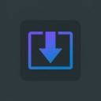

# ScreenFullPage - Full Page Screen Capture

A high-performance Manifest V3 Chrome Extension that captures full-page screenshots of the current tab and lets you save them locally as PNG, JPEG, or PDF.

## ✨ Features

*   **Full Page Capture:** Uses advanced Scroll-Capture-Stitch technology to screenshot the whole page, including long and complex layouts.
*   **Smart Scroll Detection:** Intelligently handles modern Web Apps and LLM Chat UIs (like ChatGPT, Claude, Gemini) with inner scrolling containers.
*   **High Quality Export:** Save your screenshots as **PNG**, **JPEG** (with adjustable quality), or **PDF** (with multi-page support).
*   **History Gallery:** Automatically saves your last 50 captures locally so you can review, redownload, or manage them easily.
*   **No Bloat & Privacy First:** Built entirely with pure HTML/CSS/JS. No tracking, no ads, and no remote code or external services.
*   **Keyboard Shortcut:** Quickly capture the current tab using `Alt+Shift+P` (or `Option+Shift+P` on Mac).

## 🚀 Installation (Developer Mode)

To install this extension locally for testing or development:

1.  Open Google Chrome and navigate to `chrome://extensions/`.
2.  Enable **"Developer mode"** by toggling the switch in the top right corner.
3.  Click the **"Load unpacked"** button in the top left.
4.  Select the `ScreenFullPage` directory containing this source code.
5.  The extension should now appear in your list of installed extensions and the icon will show in your browser toolbar.

## 🛠️ Technology Stack

*   **Manifest V3:** Adheres to the latest Chrome extension standards for better security and performance.
*   **Service Worker (`background.js`):** Manages the capture orchestration, quota limits (handling `MAX_CAPTURE_VISIBLE_TAB_CALLS_PER_SECOND`), and history storage.
*   **Content Scripts (`content.js`):** Measures page dimensions, manages fixed/sticky elements to prevent ghosting, and controls scrolling.
*   **Offscreen Document (`offscreen.js`):** Utilizes the HTML5 Canvas API in an isolated environment to efficiently stitch captured tiles together.
*   **Local Storage:** Uses `chrome.storage.local` to safely save large image data and capture metadata.
*   **Libraries:** Includes `jsPDF` for client-side PDF generation.

## 📦 Publishing to Chrome Web Store

Before uploading to the Chrome Web Store Developer Dashboard, you need to package the extension:

1.  Ensure all test files and unnecessary assets are removed (or excluded via your build process if you add one).
2.  Select all files in the root directory (`manifest.json`, `background.js`, `icons/`, etc.) and compress them into a `.zip` file.
    *   *Note: Do not zip the parent folder itself, zip the contents directly.*
3.  Go to the [Chrome Developer Dashboard](https://chrome.google.com/webstore/developer/dashboard) and create a new item by uploading your `.zip` file.
4.  Fill in the required store listing details (Description, Screenshots, Promotional Images).
5.  Publish an accurate privacy policy URL in the Chrome Web Store dashboard that explains screenshots are processed locally and stored in `chrome.storage.local` until the user deletes them.
6.  Submit for review!

## 📝 License

This project is completely free and open-source.
